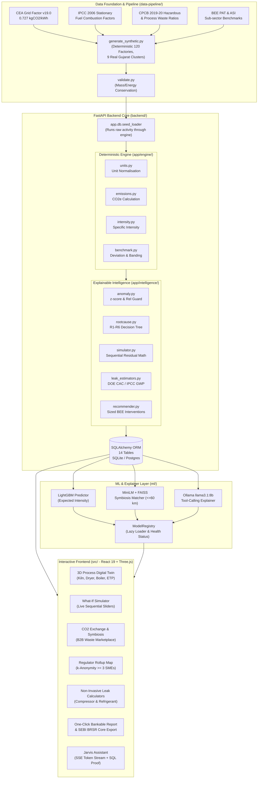

# Induscope — Circular Carbon Intelligence Platform

<div align="center">


[](https://python.org)
[](https://fastapi.tiangolo.com)
[](https://react.dev)
[](https://threejs.org)
[](https://lightgbm.readthedocs.io)
[](https://www.sbert.net/)
[](https://ollama.ai)
[](https://www.sqlalchemy.org/)
[](https://opensource.org/licenses/MIT)

**A diagnostic-and-decision intelligence platform for industrial SMEs in Gujarat's manufacturing clusters.**  
*Per-process emissions visibility • Sourced sub-sector benchmarking • Explainable root-cause diagnosis • Sequential-residual simulator • Industrial symbiosis network • Regulator cluster rollup*

Built for **HackOut'26** | Specification: *Circular Carbon Ecosystem* (Jeevesh Bodhani, DJSCE)  
Repository: **[https://github.com/vizsh/HackOut_GJ](https://github.com/vizsh/HackOut_GJ)**

</div>

---

## 📑 Table of Contents

- [Executive Summary](#-executive-summary)
- [The Problem in Gujarat's SME Clusters](#-the-problem-in-gujarats-sme-clusters)
- [System Architecture & Data Flow](#-system-architecture--data-flow)
- [Key Innovations & Engineering Disciplines](#-key-innovations--engineering-disciplines)
- [Prototype Feature Tour](#-prototype-feature-tour)
  - [1. 3D Digital Process Twin](#1-3d-digital-process-twin-diagnostics)
  - [2. Interactive What-If Simulator & Optimizer](#2-interactive-what-if-simulator--combinatoric-optimizer)
  - [3. Sourced Sub-Sector Benchmarking & Hotspots](#3-sourced-sub-sector-benchmarking--hotspots)
  - [4. Non-Invasive Leak Diagnostics](#4-non-invasive-leak-diagnostics-hardware-free)
  - [5. Industrial Symbiosis & CO2 Exchange](#5-industrial-symbiosis--co2-exchange-waste-to-input)
  - [6. Regulator Rollup & Policy Simulation](#6-regulator-rollup--policy-simulation)
  - [7. Bankable Executive Decarbonization & SEBI BRSR Reports](#7-bankable-executive-decarbonization--sebi-brsr-reports)
  - [8. Jarvis AI Assistant with Structured Verification](#8-jarvis-ai-assistant-with-structured-verification)
- [Machine Learning & Scientific Methodology](#-machine-learning--scientific-methodology)
- [Data Lineage & Disclosure](#-data-lineage--honesty-disclosure)
- [Automated Regression Gate & CI/CD](#-automated-regression-gate--cicd)
- [Complete API Endpoint Catalog](#-complete-api-endpoint-catalog)
- [Quickstart: Installation & Local Run](#-quickstart-installation--local-run)
- [Project Directory Structure](#-project-directory-structure)
- [Known Gaps & Future Roadmap](#-known-gaps--future-roadmap)

---

## 🌟 Executive Summary

Industrial Small and Medium Enterprises (SMEs) account for the vast majority of Gujarat's manufacturing backbone—from the ceramic tile kilns of **Morbi** and chemical plants of **Vapi & Ankleshwar** to textile dye houses in **Surat** and engineering casting units in **Rajkot**. 

However, virtually all of these facilities operate with **zero process-level carbon visibility**. Plant owners cannot identify which specific equipment is leaking energy or capital, lack objective benchmarks to gauge their efficiency against peers, and have no automated mechanism to monetize or exchange industrial waste with nearby factories.

**Induscope** solves this challenge through a multi-tiered engineering platform that pairs a **deterministic calculation core** (built on verified CEA, IPCC, and CPCB emission factors) with a **physics-informed intelligence layer**, an **interactive 3D digital twin**, an **industrial symbiosis matcher**, and a **regulator cluster rollup**.

> [!IMPORTANT]
> **No Magic Constants, No Invented Numbers**: Every single emission figure, benchmark range, and intervention ROI traces back to an official government or international standard (e.g., Central Electricity Authority Baseline v19.0, IPCC 2006 Fuel Factors, BEE PAT Cycle-1, CPCB Waste Guidelines). Every data field in the platform is explicitly stamped with its provenance: `real`, `calibrated`, or `is_placeholder`.

---

## 🏭 The Problem in Gujarat's SME Clusters

```
+---------------------------------------------------------------------------------------+
|                              GUJARAT INDUSTRIAL REALITY                               |
|                                                                                       |
|   [Morbi]               [Vapi / Ankleshwar]         [Surat]             [Rajkot]      |
|   Ceramics & Tiles      Dyes & Fine Chemicals       Textile Dyeing      Forging/Mach. |
|   • 70% Natural Gas     • Boiler steam leaks        • High liquor-ratio • High power  |
|   • Spray dryer drift   • Hazardous sludge            dye vessels         compressors |
|   • Flue heat loss      • Solvent VOC losses        • Effluent TDS      • Motor idling|
+---------------------------------------------------------------------------------------+
                                           │
                                           ▼
+---------------------------------------------------------------------------------------+
|                                 SME OWNER'S DILEMMA                                   |
|   1. No Per-Process Visibility: Energy bills arrive as a lump sum with no sub-metering.|
|   2. Context-Free Benchmarks: Is 0.85 tCO2/t normal for my tile size or an anomaly?    |
|   3. Fear of Bogus ROI: Vendors pitch expensive retrofits with unrealistic paybacks.   |
|   4. Waste Discard: Sludge and fly ash are landfilled at high cost rather than traded. |
+---------------------------------------------------------------------------------------+
```

---

## 📐 System Architecture & Data Flow

Induscope is built in four distinct layers that communicate through typed APIs:



---

## 💡 Key Innovations & Engineering Disciplines

### 1. The Sequential-Residual Physics Rule (No Double-Counting)
When an SME implements multiple decarbonization measures on the same equipment (e.g., waste heat recovery + air-fuel ratio automation on a ceramic roller kiln), traditional calculators incorrectly add the percentages together ($20\% + 20\% = 40\%$).  
Induscope strictly enforces the **sequential-residual rule**:

$$\text{Intensity}_{\text{after}} = \text{Intensity}_{\text{initial}} \times \prod_{i=1}^{N} (1 - \text{reduction\_ratio}_i)$$

Two 20% measures yield a physically sound **36% combined reduction**, not 40%. The same formulation is mirrored identically between the frontend TypeScript simulator (`src/lib/simulator.ts`) and backend Python optimizer (`backend/app/intelligence/simulator.py`).

### 2. Verified Benchmark Confidence Grading
Rather than presenting arbitrary thresholds, benchmarks carry explicit transparency tags:
* `real`: Sourced from official statutory bodies (e.g., BEE PAT Cycle-1 for textile processing).
* `calibrated`: Literature-backed industrial audit averages (TERI, NPC, Gujarat Cleaner Production Centre) adjusted for plant capacity bands.
* `is_placeholder`: Explicitly flagged when public data is unavailable (such as embodied-carbon factors in local waste streams).

### 3. Empirical Machine Learning Discipline
* **LightGBM Benchmark Predictor**: Predicts process carbon intensity based on fuel mix, throughput scale, and process type. Achieves **+36.9% MAE improvement** over flat benchmarks in known clusters.
* **MiniLM + FAISS Symbiosis Matching**: Semantic matching of industrial byproduct descriptions against accepted raw materials, filtered by real **Haversine road proximity ($\le 60\text{ km}$)**.
* **Honest Evaluation & Negative Results**: A deep PyTorch conditional autoencoder was rigorously trained and evaluated for anomaly detection. When empirical tests demonstrated that the neural network achieved lower precision than an empirically tuned z-score rule with a relative guard ($z=2.5, \text{guard}=15\%$), **the neural network was deliberately kept out of production**.

---

## 🖥️ Prototype Feature Tour

### 1. 3D Digital Process Twin (Diagnostics)
* **Interactive 3D Factory Floor**: Powered by Three.js and React Three Fiber, featuring procedurally modeled industrial assets:
  * **Roller Kiln**: Thermal emission rendering, natural gas fuel monitoring, and heat plume particles.
  * **Spray Dryer**: Cyclone separators, hot gas ductwork, and atomizing slurry feed.
  * **Boiler House**: Steam manifold, flue gas stack, and blowdown monitoring.
  * **Compressor House**: Rotary screw compressor bays with load/unload cycle animations.
  * **Glaze Line**: Spray booths, conveyor motors, and glaze recovery catchments.
  * **Effluent Treatment Plant (ETP)**: Aeration tanks, chemical dosing, and sludge clarifiers.
* **Dynamic Hotspot Telemetry**: Equipment meshes transition from neutral slate to amber warning or crimson critical based on benchmark deviations and active anomaly states. Clicking any machine triggers a smooth camera fly-to inspection with detailed process KPIs.

```
+---------------------------------------------------------------------------------------+
|  3D DIGITAL PROCESS TWIN                                            [Morbi Ceramics]  |
|                                                                                       |
|      ( ) Cyclone Dryer                  [==== Roller Kiln ====]                       |
|           /--------\                     |  1,420 tCO2e/yr    | (CRITICAL HOTSPOT)    |
|          |  HOT AIR |                    |  Deviation: +48%   |                       |
|           \--------/                     [====================]                       |
|               ||                                  ||                                  |
|         [Compressors]                     [Effluent Plant]        [Glaze Line]        |
|        Load/Unload: 32%                   Sludge: 120 t/yr        Recycle: 0%         |
+---------------------------------------------------------------------------------------+
```

---

### 2. Interactive What-If Simulator & Combinatoric Optimizer
* **Interactive Decarbonization Sandbox**: Plant managers toggle specific circular interventions (e.g., *Air-to-Air Heat Exchanger*, *VFD on Combustion Blowers*, *Fly Ash Substitution*) and watch emissions, annual INR operational savings, net CAPEX, and blended payback recompute live.
* **Brute-Force Combinatoric Optimizer**: Solves for the mathematically optimal combination of interventions under an SME's specific constraints (e.g., *“Find highest $\text{CO}_2$ cut under ₹25 Lakh budget with payback $< 18$ months”*).

---

### 3. Sourced Sub-Sector Benchmarking & Hotspots
* Evaluates equipment against multi-tier benchmarks:
  1. **Statutory Benchmark** (BEE PAT / National target).
  2. **Cluster Average** (Regional peer group in Morbi, Vapi, Surat, etc.).
  3. **ML-Predicted Intensity** (LightGBM model adjusting for fuel mix and throughput).
  4. **Capacity-Band Multiplier** (Scale adjustments for micro, small, and medium enterprises).
* **R1–R6 Root-Cause Decision Tree**: Automatically links anomalies to actionable root causes (e.g., *R2: High-carbon fuel skew to pet coke*, *R3: Thermal combustion degradation*, *R5: Maintenance fouling trend*).

---

### 4. Non-Invasive Leak Diagnostics (Hardware-Free)
SMEs rarely have capital for expensive ultrasonic leak detectors or optical gas imaging (OGI) cameras. Induscope provides two **formulaic, invoice-based leak calculators**:

1. **Compressed Air Load/Unload Timing Test** (DOE / Compressed Air Challenge Method):
   * Measures compressor loaded vs. unloaded duration during an off-shift non-production window:
   
   $$\text{Leak Fraction} = \frac{t_{\text{load}}}{t_{\text{load}} + t_{\text{unload}}}$$
   
   * Computes wasted CFM, lost kWh/year, avoidable electricity cost in ₹, and associated $\text{tCO}_2\text{e}$.

2. **Refrigerant Continuous Leak Inference** (IPCC AR5 GWP Method):
   * Treats annual refrigerant top-ups not as routine maintenance, but as physical leakage:
   
   $$\text{Leakage Rate} = \frac{\text{Annual Top-up (kg)}}{\text{Nameplate Charge (kg)}} \times 100$$
   $$\text{Emissions} = \frac{\text{Top-up (kg)} \times \text{GWP}_{100}}{1000} \text{ tCO}_2\text{e}$$
   
   * Supports R-22, R-134a, R-404A ($\text{GWP} = 3922$), R-407C, and R-410A.

---

### 5. Industrial Symbiosis & CO2 Exchange (Waste-to-Input)
* **B2B Circular Marketplace**: Matches waste-producing factories with nearby plants that can utilize those byproducts as secondary raw materials.
* **Algorithmic Match Scoring**:
  * **50% Semantic Compatibility**: MiniLM vector cosine similarity between byproduct descriptions and raw material acceptance profiles.
  * **25% Geographic Proximity**: Calculated via Haversine distance, constrained to a strict $\le 60\text{ km}$ logistics radius.
  * **25% Quantity Fit**: Evaluates supply vs. demand volume matching.
* **Mutual Economic Ledger**: Real-time computation of provider waste disposal savings (₹/yr) and recipient virgin material purchase discounts (₹/yr).

```
+---------------------------------------------------------------------------------------+
|  INDUSTRIAL SYMBIOSIS MATCH                                      Score: 88%  [60km]   |
|                                                                                       |
|   [Morbi Ceramics Unit 01]   =======================>   [Rajkot Refractories Ltd]     |
|   Waste: Broken Fired Tiles                             Input: Crushed Chamotte Grog  |
|   Volume: 420 Tonnes/yr                                 Demand: 600 Tonnes/yr         |
|   Disposal Saving: ₹1.68 Lakh/yr                        Material Saving: ₹3.78 Lakh/yr|
+---------------------------------------------------------------------------------------+
```

---

### 6. Regulator Rollup & Policy Simulation
* **Gujarat Cluster Rollup Map**: Leaflet-powered GIS map of Gujarat's 9 key industrial hubs displaying aggregate emissions, average carbon intensities, and cluster anomaly rates.
* **k-Anonymity Privacy Suppression**: To safeguard competitive SME production data, any industrial cluster or filter yielding fewer than 3 reporting factories automatically suppresses individual identity and displays aggregated statistical bounds only ($k \ge 3$).
* **State-Wide Scale Projection & Carbon Credit Valuation**:
  * Dynamic scaling projection: *“If this intervention profile scaled to $N$ factories across Gujarat...”*
  * Computes projected compliance carbon credit value under India's Carbon Credit Trading Scheme (CCTS) at an indicative ₹900/$\text{tCO}_2\text{e}$.

---

### 7. Bankable Executive Decarbonization & SEBI BRSR Reports
* **Executive Summary Report** (`/report/:factoryId`): A single-page, print-ready decarbonization dossier designed for SME promoters to present directly to banks for green lending (e.g., SIDBI green finance) or executive boards.
* **SEBI BRSR Core Disclosure Extract** (`/report/:factoryId/brsr`): Formats factory activity directly into the reporting requirements of SEBI’s Business Responsibility and Sustainability Reporting (BRSR) Core:
  * Principle 6: Scope 1 (direct fossil fuel combustion) & Scope 2 (grid electricity consumption).
  * Specific water consumption intensity ($\text{m}^3/\text{t}$ output).
  * Hazardous vs. non-hazardous waste generation and disposal breakdown.

---

### 8. Jarvis AI Assistant with Structured Verification
* **Tool-Calling Architecture**: Built on Ollama (`llama3.1:8b`) with Server-Sent Events (SSE) streaming (`POST /api/ask/stream`).
* **Anti-Hallucination Guardrails**: Rather than relying on unstructured LLM memory, Jarvis executes real backend analytical tools (`run_optimizer`, `lookup_factory_benchmark`, `find_symbiosis_partners`, `rank_hotspots`).
* **Transparency Card**: Every LLM response renders alongside a `verified_data` evidence payload displaying the exact raw database record, ensuring the user can verify any Lakh/Crore calculations.
* **Deterministic Graceful Fallback**: If Ollama is offline or unreachable, the system automatically degrades to a deterministic, rule-based answering engine without crashing.

---

## 📊 Machine Learning & Scientific Methodology

| Component | Model Architecture | Inputs / Features | Evaluation Metric & Result | Production Status |
|---|---|---|---|---|
| **Benchmark Predictor** | LightGBM Regressor (`benchmark_model.py`) | Sector, process kind, fuel shares, annual output scale | **+36.9% MAE gain** (seen clusters)<br>**+6.3% MAE gain** (leave-one-cluster-out) | **Active in Production** (`GET /api/factories/:id/benchmark`) |
| **Symbiosis Matcher** | `sentence-transformers/all-MiniLM-L6-v2` + FAISS | Waste tag descriptions, form (solid/liquid/heat), quantity | Threshold: $0.65$ cosine similarity (filters physical false positives like textile sludge $\to$ raw cotton) | **Active in Production** (`GET /api/symbiosis/network`) |
| **Tool-Calling Explainer** | Ollama `llama3.1:8b` + Pydantic tools | Natural language query + verified database context | Structural validation against SQL state; Lakh/Crore restatement guardrails | **Active in Production** (`POST /api/ask`) |
| **Anomaly Detector** | Conditional Autoencoder (`anomaly_model.py`, PyTorch) | 12-month normalized process emission series + condition | Precision: $0.01$, Recall: $0.85$ (Failed to beat rule-based baseline) | **Honestly Rejected** (Kept out of production) |
| **Anomaly Baseline** | Leave-one-out z-score with relative guard | Monthly process $\text{tCO}_2\text{e}$ series | **Precision: 0.57, Recall: 0.92** ($z=2.5, \text{guard}=15\%$) | **Active in Production** (`GET /api/factories/:id/anomalies`) |

---

## 🔍 Data Lineage & Honesty Disclosure

Transparency regarding data sources and limitations is a foundational design requirement:

| Data Element | Primary Sourced Reference | Value / Range | Lineage Tag | Notes |
|---|---|---|---|---|
| **Gujarat Grid Electricity** | Central Electricity Authority (CEA) CO2 Baseline Database v19.0 (FY2023-24) | $0.727 \text{ kgCO}_2/\text{kWh}$ | `real` | Replaced legacy mis-cited v21.0 value ($0.710$). |
| **Natural Gas Combustion** | IPCC 2006 Guidelines for National GHG Inventories, Vol 2, Ch 2 | $2.04 \text{ kgCO}_2\text{e}/\text{SCM}$ ($56.1 \text{ kg/GJ}$) | `real` | Standard pipeline quality natural gas. |
| **Coal Combustion** | IPCC 2006 Guidelines, Vol 2, Table 2.2 (Sub-bituminous / Indian domestic) | $2.42 \text{ kgCO}_2\text{e}/\text{kg}$ ($96.1 \text{ kg/GJ}$) | `real` | Representative Indian industrial coal. |
| **Pet Coke Combustion** | IPCC 2006 Guidelines, Vol 2, Table 2.2 | $3.15 \text{ kgCO}_2\text{e}/\text{kg}$ ($97.5 \text{ kg/GJ}$) | `real` | Sourced from Gujarat petroleum refining. |
| **Textile Benchmarks** | BEE Perform, Achieve and Trade (PAT) Scheme Cycle-1 (2012-15) | $0.82 \text{ tCO}_2/\text{t}$ fabric processed | `real` | Sourced statutory scheme. |
| **Ceramic Benchmarks** | Sourced audit averages (Gujarat Cleaner Production Centre / TERI) | $0.28 \text{ tCO}_2/\text{t}$ tile | `calibrated` | Documented estimate; PAT Cycle-1 did not cover ceramics. |
| **Water Benchmarks** | TERI Tirupur Textile Water Study (Dyeing/Finishing) | $85.0 \text{ m}^3/\text{t}$ fabric | `real` | Marked `available: false` outside textile dyeing. |
| **SME Factory Profiles** | Deterministic generator calibrated to GIDC cluster capacities | 120 Factories across 9 Clusters | `calibrated` | Necessary because ASI microdata is not publicly downloadable. |
| **Carbon Credit Valuation** | CCTS indicative compliance market estimate | ₹900 / $\text{tCO}_2\text{e}$ | `calibrated` | Midpoint of analyst estimates (₹600–1,200); CCTS floor pending. |
| **Symbiosis CO2 Avoided** | Embodied carbon conversion factor | Variable by stream | `is_placeholder` | Economic savings (₹) are real; carbon avoidance is tagged placeholder. |

---

## 🛡️ Automated Regression Gate & CI/CD

Induscope features an end-to-end automated verification test suite:

```bash
python scripts/validate_all.py
```

The script executes 7 sequential stages:
1. **Regenerates Synthetic Data**: Confirms reproducible, deterministic output matching SHA integrity.
2. **Pipeline Validation**: Asserts mass and energy conservation laws and schema adherence.
3. **Backend Database Seeding**: Executes live calculations across all 120 factories.
4. **Z-Score Anomaly Verification**: Asserts precision $\ge 0.50$ and recall $\ge 0.85$ against injected ground-truth anomalies.
5. **Benchmark ML Evaluation**: Verifies LightGBM model performance exceeds tolerance floors in `validation/baseline_metrics.json`.
6. **Symbiosis Matcher Check**: Enforces similarity threshold $\ge 0.65$ to prevent false-positive pairing.
7. **FastAPI End-to-End Smoke Test**: Exercises all REST endpoints, onboarding flows, CSV bulk uploads, leak calculators, and auth token tampering guards.

---

## 📡 Complete API Endpoint Catalog

| Method | Endpoint | Description | Access Tier |
|---|---|---|---|
| `GET` | `/api/health` | Service health status check | Public |
| `POST` | `/api/auth/login` | PBKDF2 authentication, issues signed session token | Public |
| `GET` | `/api/auth/me` | Current user profile and role verification | Authenticated |
| `GET` | `/api/clusters` | List all 9 GIDC clusters with anomaly and factory counts | Public |
| `GET` | `/api/clusters/{id}/factories` | Factories operating within a specific cluster | Public |
| `GET` | `/api/factories` | Full list of factories with computed emissions | Public |
| `GET` | `/api/factories/summary` | Lightweight factory metadata for maps and rollups | Public |
| `GET` | `/api/factories/{id}` | Detailed factory profile including equipment tree | Public |
| `GET` | `/api/factories/{id}/emissions` | Monthly activity logs with transparent factor lineage | Public |
| `GET` | `/api/factories/{id}/benchmark` | Multi-tier benchmark comparison (Statutory, ML, Cluster) | Public |
| `GET` | `/api/factories/{id}/anomalies` | Flagged anomaly months with z-scores | Public |
| `GET` | `/api/factories/{id}/recommendations`| Sized BEE circular interventions with ROI | Public |
| `POST`| `/api/factories` | Onboard a new SME factory and compute initial emissions | Public |
| `POST`| `/api/factories/{id}/activity` | Append a monthly activity record (triggers auto-recompute) | Public |
| `POST`| `/api/factories/{id}/activity/csv` | Bulk activity ingestion from utility bill CSV | Public |
| `POST`| `/api/factories/{id}/leak-assessments/compressed-air/load-unload-test` | Compressed air leak calculation from timing test | Public |
| `POST`| `/api/factories/{id}/leak-assessments/refrigerant` | Refrigerant continuous leak assessment from top-up | Public |
| `GET` | `/api/factories/{id}/water-benchmark` | Specific water consumption benchmark (Textiles) | Public |
| `GET` | `/api/factories/{id}/cross-process-insights` | Heat-source and heat-sink pairing opportunities | Public |
| `GET` | `/api/symbiosis/network` | Full industrial symbiosis matching graph | Public |
| `GET` | `/api/factories/{id}/symbiosis-matches` | Factory-specific waste byproduct matches | Public |
| `POST`| `/api/ask` | Global cross-factory Jarvis explainer query | Public |
| `POST`| `/api/ask/stream` | Server-Sent Events (SSE) streaming Jarvis explainer | Public |
| `GET` | `/api/ml/status` | Real-time operational status of all ML models | Public |
| `GET` | `/api/scale-projection` | State-wide emission and CCTS carbon credit projection | Public |
| `POST`| `/api/organizations` | Create consulting or group workspace | Authenticated |
| `PATCH`| `/api/factories/{id}/consent` | Update data-sharing consent for regulator rollup | Authenticated |
| `POST`| `/api/organizations/{id}/api-keys` | Mint developer API key with rate limiting | Authenticated |

---

## 🚀 Quickstart: Installation & Local Run

### Prerequisites
* **Python 3.11+**
* **Node.js 18+** & `npm`
* *(Optional)* **Ollama** with `llama3.1:8b` for local AI assistant (`ollama pull llama3.1:8b`)

```bash
# Clone the repository
git clone https://github.com/vizsh/HackOut_GJ.git
cd HackOut_GJ
```

### 1. Backend Setup & Seeding
```bash
cd backend
pip install -r requirements.txt

# Run database migrations (creates SQLite schema)
python -m alembic upgrade head

# Seed 120-factory dataset through the real calculation engine
python -m app.db.seed_loader

# Start the FastAPI backend server (port 8811)
python -m uvicorn app.main:app --port 8811
```

### 2. Machine Learning Models
```bash
# In a new terminal from the repository root:
pip install -r ml/requirements.txt

# Train and cache the LightGBM benchmark predictor
python -m ml.benchmark_model

# Run the MiniLM + FAISS symbiosis matcher (downloads model on first run)
python -m ml.symbiosis_model
```

### 3. Frontend Development Server
```bash
# In a new terminal from the repository root:
npm install
npm run dev

# Open in browser:
# http://localhost:5173/app.html
```

> [!TIP]
> **Demo Login Credentials**  
> Password for all seeded accounts: `induscope-demo`  
> • SME Owner: `sme@induscope.demo`  
> • ESG Consultant: `consultant@induscope.demo`  
> • GPCB / Cluster Regulator: `regulator@induscope.demo`

---

## 📁 Project Directory Structure

```
HackOut_GJ/
├── data-pipeline/                 # Sourced parameters & synthetic data generation
│   ├── clean/                     # Verified CSVs (emission factors, clusters, benchmarks)
│   ├── scripts/                   # generate_synthetic.py, validate.py
│   ├── synth/                     # 120-factory dataset & anomaly ground-truth JSONs
│   ├── sources.md                 # Primary citation audit trail
│   ├── LIMITATIONS.md             # Documented data gaps & boundary conditions
│   └── SYNTHETIC_DATA_DISCLOSURE.md
├── backend/                       # FastAPI + SQLAlchemy Core
│   ├── app/
│   │   ├── engine/                # Deterministic calculation functions (units, emissions)
│   │   ├── intelligence/          # Anomaly detection, root cause, simulator, leak estimators
│   │   ├── db/                    # 14 SQLAlchemy ORM models, seed loader, migrations
│   │   ├── routers/               # REST API endpoints (factories, leaks, symbiosis, explainer)
│   │   ├── auth.py                # PBKDF2 hashing & HMAC signed session tokens
│   │   └── main.py                # FastAPI app configuration & middleware
│   └── alembic/                   # Database migration history
├── ml/                            # Machine learning & scientific intelligence
│   ├── benchmark_model.py         # LightGBM carbon intensity predictor
│   ├── symbiosis_model.py         # MiniLM + FAISS vector search matcher
│   ├── anomaly_model.py           # PyTorch conditional autoencoder (honestly rejected)
│   ├── explainer.py               # Ollama llama3.1:8b tool-calling agent with fallback
│   ├── registry.py                # Process-wide ModelRegistry singleton
│   └── LIMITATIONS.md             # ML evaluation writeups & negative results
├── src/                           # React 19 + TypeScript + Three.js Frontend
│   ├── components/
│   │   ├── twin/                  # 3D digital twin components & procedural machines
│   │   ├── dashboard/             # Hotspot cards, KPI bar, equipment details
│   │   ├── simulator/             # Interactive what-if intervention sliders
│   │   ├── assistant/             # Jarvis floating chat widget with SSE stream
│   │   └── layout/                # Global navigation bar & header
│   ├── pages/                     # 13 Application views (Factory, Simulator, Regulator, etc.)
│   ├── store/                     # Zustand state store with localStorage persistence
│   └── lib/                       # API clients, adapters, and TypeScript physics engine
├── validation/                    # Baseline metrics & tolerance floors
│   └── baseline_metrics.json
├── scripts/
│   └── validate_all.py            # End-to-end regression testing gate
└── README.md                      # Project documentation
```

---

## 🔮 Known Gaps & Future Roadmap

1. **Direct SME Waste Onboarding**: The intake form UI currently collects waste streams, but the `POST /api/factories` endpoint does not yet persist them; onboarded factories initialize with 0 t/yr waste until an update endpoint is deployed.
2. **Live Factory Patch Endpoint**: Editing an already onboarded factory currently updates client-side state only; full `PATCH /api/factories/{id}` persistence is scheduled for the next release.
3. **Sub-Sector Expansion**: Full 3D machine geometries are optimized for ceramics, textiles, and light engineering; specialized distillation column and batch reactor 3D models for specialty chemicals are underway.
4. **Cloud Deployment Architecture**: SQLite can be ported directly to Supabase/Neon PostgreSQL, FastAPI containerized for Fly.io/Render, and the React frontend deployed on Vercel with zero breaking schema changes.

---

<div align="center">

**Induscope — Driving Gujarat's Industrial SME Transition to a Circular Carbon Future.**  
*Engineered with mathematical discipline and scientific integrity for HackOut'26.*

</div>
